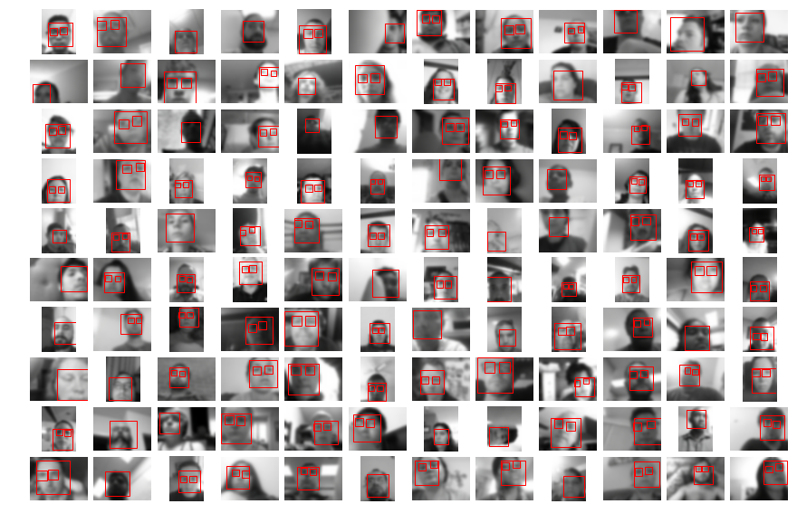
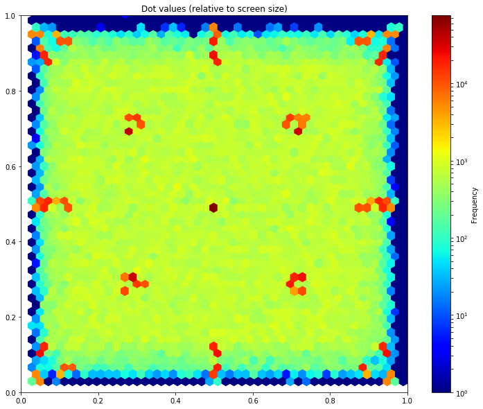

# Eye Tracking: EDA/Modeling of GazeCapture Data



As a part of my graduate studies at Regis University, I have had the opportunity to begin exploring my own project during my Deep Learning class. 

- Dataset Source: https://github.com/CSAILVision/GazeCapture

- Regis University (M.S. in Data Science): https://www.regis.edu/CCIS/Academics/Degrees-Programs/Graduate-Programs/MS-Data-Science.aspx

By using this data set before my practicum (Spring 2019), I hope to not only explore and model some interesting data but also be prepared to solve the eye tracking problem by combining known solutions as well as current research in Deep Learning (e.g. synthetic data training, JavaScript Convnets, pre-trained model adaptation) and thereby bring some of the concepts presented by Krafka et al. (2016) to the web.

# Weekly Updates

As I progress through this 8-week class (and this project), I hope to give weekly updates on my progress, list helpful resources, and plan for the next week. Here are the writings I've completed:

- [Week 1: GazeCapture download, DataCamp tutorials, custom computer, and prep work](writings/week-01-dated-09-01-2018.md)
- [Week 2: Exploratory data analysis w/ cool visualizations, quick blog article, and reading](writings/week-02-dated-09-08-2018.md)

# Linked Articles

[Visualization Quick Tip: Relative Heatmaps, Medium.com](https://medium.com/@rcdilorenzo/visualization-quick-tip-relative-heatmaps-86a52a0c5a0c)

<a href="https://medium.com/@rcdilorenzo/visualization-quick-tip-relative-heatmaps-86a52a0c5a0c"></a>

# Run Locally

```
# Register email and wait for approval (http://gazecapture.csail.mit.edu/download.php)
# Note that the data set is ~ 150 GB
wget -O gazecapture.tar "<INSERT APPROVED URL>"

# Extract and decompress all subfolders and place in this location
# (or change FOLDER_DIR in jupyter notebooks)
mv gazecapture ~/Documents/data/gazecapture

# Clone this repo
git clone https://github.com/rcdilorenzo/msds-686-eye-tracking.git

# Start jupyter notebook server
jupyter notebook

# Enable the data collection cell of the `eye-tracking-eda` notebook
#
#    # Collect everything into single CSV (~ 600 MB)
#    collect_data(FOLDER_DIR)
#

# Run the notebooks, sit back, and relax!
```

# References

**Eye Tracking for Everyone**
K.Krafka\*, A. Khosla\*, P. Kellnhofer, H. Kannan, S. Bhandarkar, W. Matusik and A. Torralba
*IEEE Conference on Computer Vision and Pattern Recognition (CVPR), 2016*
