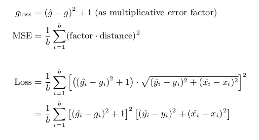

# Inspector Lestrade
A Deep Learning project for predicting gaze location from a front-facing iOS camera

<a href="discussion/InspectorLestrade-RChristianDiLorenzo-2018Oct.pdf"></a>

<a href="discussion/InspectorLestrade-RChristianDiLorenzo-2018Oct.pdf">InspectorLestrade: An 8-Week Foray into Predicting Eye Gaze</a>

**What's with the name?**

> Inspector Lestrade: “I find it hard enough to tackle facts, Holmes, without flying away after theories and fancies."
>
> "You are right," said Holmes demurely: "you do find it very hard to tackle the facts.”
>
> ― Arthur Conan Doyle

He's always confident, but not always right.

## Table of Contents

- [Background](#background)
- [Writings](#writings)
  - [Week 1: GazeCapture download, DataCamp tutorials, custom computer, and prep work](writings/week-01-dated-09-01-2018.md)
  - [Week 2: Exploratory data analysis w/ cool visualizations, quick blog article, and reading](writings/week-02-dated-09-08-2018.md)
  - [Week 3: 3D Facial landmarks, Open Images v4, Yolo v3, and 2TB RAID upgrade](writings/week-03-dated-09-15-2018.md)
  - [Visualization Quick Tip: Relative Heatmaps, Medium.com](https://medium.com/@rcdilorenzo/visualization-quick-tip-relative-heatmaps-86a52a0c5a0c)
  - [Week 4: 🎥 Face Alignment, Yolo v3 Training, and 2nd 1080 Ti](https://youtu.be/QvKLHZyOniE)
  - [Week 5: A Running Multi-Input DNN, Tensorflow Image Preprocess, TIL Yolo](writings/week-05-dated-09-29-2018.md)
  - [Week 6: 📝 Neural Network Architecture and Loss Functions](https://rcd.ai/eye-tracking-nn-and-loss/)
  - [Week 7: 📝 Activation Functions](https://rcd.ai/eye-tracking-nn-activation-functions/)
- [Project Discussion](#project-discussion)

## Background

As a part of my graduate studies at Regis University, I have had the opportunity to begin exploring my own project during my Deep Learning class.

- Dataset Source: https://github.com/CSAILVision/GazeCapture

- Regis University (M.S. in Data Science): https://www.regis.edu/CCIS/Academics/Degrees-Programs/Graduate-Programs/MS-Data-Science.aspx

Note that in order to use any of the files in this repository for training purposes, the GazeCapture data set will be needed. Visit http://gazecapture.csail.mit.edu/download.php for details on requesting approval.

If you just want to use the pretrained models and explore the various architecture iterations, just clone the repository and checkout the [results.ipynb notebook](results.ipynb). I can't guarantee that everything will run the first time, but I've made an effort to make the code well-written and easily discoverable through the notebooks throughout the repository. However, I have had limited time so proceed at your own risk! :-)

## Writings

As I progress through this 8-week class (and this project), I've given weekly updates on my progress or on specific topics I am working through.

- [Week 1: GazeCapture download, DataCamp tutorials, custom computer, and prep work](writings/week-01-dated-09-01-2018.md)
- [Week 2: Exploratory data analysis w/ cool visualizations, quick blog article, and reading](writings/week-02-dated-09-08-2018.md)
- [Week 3: 3D Facial landmarks, Open Images v4, Yolo v3, and 2TB RAID upgrade](writings/week-03-dated-09-15-2018.md)
- [Visualization Quick Tip: Relative Heatmaps, Medium.com](https://medium.com/@rcdilorenzo/visualization-quick-tip-relative-heatmaps-86a52a0c5a0c)
- [Week 4: 🎥 Face Alignment, Yolo v3 Training, and 2nd 1080 Ti](https://youtu.be/QvKLHZyOniE)
- [Week 5: A Running Multi-Input DNN, Tensorflow Image Preprocess, TIL Yolo](writings/week-05-dated-09-29-2018.md)
- [Week 6: 📝 Neural Network Architecture and Loss Functions](https://rcd.ai/eye-tracking-nn-and-loss/)
- [Week 7: 📝 Activation Functions](https://rcd.ai/eye-tracking-nn-activation-functions/)

## Project Discussion

<a href="discussion/InspectorLestrade-RChristianDiLorenzo-2018Oct.pdf"></a>

<a href="discussion/InspectorLestrade-RChristianDiLorenzo-2018Oct.pdf">InspectorLestrade: An 8-Week Foray into Predicting Eye Gaze</a>

> All of the following material is available in the PDF document and was specifically written for that layout. Check it out [there](discussion/InspectorLestrade-RChristianDiLorenzo-2018Oct.pdf) or continue reading here.

### Introduction

Most applications of eye tracking firmly lie within medicine or user-based research and are dominated by specialized devices with external sensors and wearables. With the advent of computationally feasible Deep Learning, what was previously outside the reach of the everyday user may well be possible now.

For example, a common measure of eye strength involves saccade latency and accuracy, that is, the ability to jump from one visual focus to another. Currently, both the exercises and testing must be done with specialized equipment. If the predictive power of neural networks were applied to this problem, patients would be able to perform exercises on their own and thereby have the tools to measure and perhaps even overcome eye disabilities.

> 
>
> *FIG. 1. A sample of the +1400 participants with bounding boxes of eyes and faces determined by the built-in, real-time detection system of iOS.*

In this work, I present my modeling process to predict from a front-facing iOS camera the gaze location of person’s eyes relative to the device’s lens. Using the data set GazeCapture from Krafka et al. (2016) containing almost 2.5M frames, I trained a deep convolutional neural network called InspectorLestrade<sup>[1](#footnote1)</sup> to predict a gaze coordinate relative to the lens as well as the probability that both eyes are within the frame.

#### Background

As a part of my Deep Learning class for my masters in Data Science, I have been privileged to not only self-determine a project but also have the entire 8-week semester to produce a decent model. With some knowledge of machine learning but essentially no experience with Deep Learning, the current results of this project are very much a work in progress and further effort would be needed before its utility could be realized in any real situation. The detailed limitations will be discussed further in a later section.

Due to previous interest in eye tracking from my work at a software consultancy, I did a bit of searching and stumbled upon the work of Krafka et al. (2016). This data set, named GazeCapture<sup>[2](#footnote2)</sup>, contains data of nearly 2.5 million images of over 1400 participants gathered via crowdsourcing. Because my goal was to understand Deep Learning over the course of this project, I only did a preliminary read of their paper and entirely skipped the section on their model iTracker in order to keep my bias free.<sup>[3](#footnote3)</sup> Throughout the entire process, I wrote weekly updates either directly on the status of the project or individual bits of learning. The writings, pretrained models, and all code are available from the repository: https://github.com/rcdilorenzo/inspector-lestrade.

### Exploratory Data Analysis

Before considering model architectures, an exploratory data analysis<sup>[4](#footnote4)</sup> (EDA) revealed some important details about GazeCapture. As seen in Fig. 2, a variety of devices were employed through the crowdsourced outlet which produces a good range of screen sizes from the iPhone 4S to the 12.9” iPad Pro. Likewise, Table I shows the maximum extents of the data which will later be important if the model is specialized to iOS devices.

> 
>
> *FIG. 2. Frequency of frames taken by iOS device type.*


> |      | dotInfo.XPts | dotInfo.YPts | dotInfo.XCam | dotInfo.YCam |
> |------|--------------|--------------|--------------|--------------|
> | mean | 294.22       | 260.50       | 0.12         | -1.85        |
> | min  | 40.00        | 40.00        | -26.52       | -26.52       |
> | max  | 1326.00      | 1326.00      | 26.52        | 26.52        |
>
> *TABLE I. Extent of dot information. “Pts” represent screen pixels while “Cam” represents centimeters from camera lens (normalized by the lens location on each device type).*

Beyond these basic numbers, a scaled representation as seen in Fig. 3 illustrates the distribution of dots that participants are asked to gaze at while their picture is repeatedly taken from the front-facing camera. This visualization clearly indicates that all of the primary sectors of the device were covered in addition to some uniformly random points across the entire screen.

> 
>
> *FIG. 3. Frequency and distribution of generated dots for each device.*

For the purposes of this project, however, the most important distribution is the absolute position of the dots in centimeters from the camera lens. Fig. 4 clearly shows not only the outline of multiple device sizes–5.7”, 9.7”, and 12.9”–but also the various device orientations–portrait, upside-down portrait, landscape left, and landscape right. Note how the iPhone is never used in the upside-down orientation as well as the left offset of the camera seen in the mismatched landscape iPhone frequencies.

> 
>
> *FIG. 4. Frequency and distribution of dots in centimeters
from the camera.*

### Data Preprocessing

Both before and during the modeling stage, data preprocessing was an essential component. To explore these details, the initial two approaches must be briefly outlined.

#### Approach 1: Object Detection of Eyes

Although this approach was eventually dropped due to time constraints, it was certainly sound in concept. Although Krafka et al. (2016) included the real-time iOS predictions of eyes and faces, my initial exploration revealed that these bounding boxes were seriously wanting. Finding the freely available sample<sup>[5](#footnote5)</sup> of Open Images v4 by Krasin et al. (2017), I employed YOLOv3 by Redmon and Farhadi (2018) to more accurately find bounding boxes labeled “Human eye” from Open Images.

To accomplish this task, however, the entire sample needed to be downloaded (∼560 GB) in order to have available images. From multiple metadata files, image paths had to be cross-referenced with bounding boxes after being filtered by tag name (i.e. “Human eye”).

Most of the data preprocessing<sup>[6](#footnote6)</sup> consisted of transforming the Open Image metadata into the text file format readily accepted by YOLOv3 (Redmon and Farhadi, 2018). For example, each bounding box was listed as a separate row even though it referenced the same image. These had to be grouped and then assigned a numerical class identifier (in this case just 0 for a single class). Below is a sample of the produced text file.

```
openimagesv4/train_08/000004f4400f6ec5.jpg 489,509,274,303,0 618,645,216,232,0 675,696,219,229,0
openimagesv4/train_08/0000271195f2c007.jpg 424,522,429,486,0 573,650,440,494,0
...
```

#### Approach 2: Face Landmarks

The second approach begins with an external deep neural network that identifies facial landmark features in 3D-space. Using the face-alignment network of Bulat and Tzimiropoulos (2017), points of the jaw, mouth, nose, eyebrows, and eyes are projected into 3D space even when certain portions of the face do not entirely appear in the frame.

> 
>
> *FIG. 5. Transforming landmarks to 128x128 eye images.*
>
> *(face-landmarks-modeling-preprocessing.ipynb: https://git.io/fxoSN)*

From these facial features, a bit of data preprocessing was performed to produce the necessary inputs for InspectorLestrade–128x128 images of the left and right eyes as well as the scaled landmark points (Fig. 5). Several hurdles had to be overcome to produce a successful slice for every set of facial landmarks.<sup>[7](#footnote7)</sup> For example, sometimes the landmarks fall outside of the image such as when only half of a face is visible. Because InspectorLestrade always expects the same size inputs, it was necessary to create a 1px vertical slice closest to the “invisible” eye and then expand it to the expected 128x128 size. As will be seen later, this became a hurdle for the modeling process.

For the training process, these eye images needed be sliced either on the fly or beforehand. Due to the longer computational complexity of predicting these landmarks over slicing the images, I opted to run the face-alignment network across all the frames in preparation for training InspectorLestrade. Although the preprocessing of the landmarks took nearly an entire week to save the results in batches, 8 it enabled slicing images on the fly and thereby more concentrated focus on modeling InspectorLestrade.

Additionally, the raw points from the face-alignment library (Bulat and Tzimiropoulos, 2017) needed to be scaled. Using the distribution of the x, y, and z values, ‘StandardScaler’ from ‘sklearn’ could be used to create smaller values for better neural network performance. This distribution information is then saved for later retrieval during prediction.

> 
>
> *FIG. 6. Visual overview of the inputs and outputs of InspectorLestrade.*

All of these preprocessing elements are brought together into the ‘InspectorLestradeGenerator’<sup>[9](#footnote9)</sup> that takes the original GazeCapture data frame plus the pregenerated landmarks. In turn, it renders the inputs and outputs for training. The inputs include the three elements seen in Fig. 6 while the outputs include an (x, y) coordinate as well as a boolean output of whether both eyes were visible (roughly corresponding to whether the person is actually looking at the screen at all).

### Modeling

#### Approach 1: Object Detection of Eyes

With Python and keras chosen as the primary technologies for the class, I employed a keras version<sup>[10](#footnote10)</sup> of the YOLOv3 architecture that provided a decent example of retraining the existing weights for a new object classification problem. In a transfer learning problem such as this first approach, freezing most of the layers for the first phase of training is common. As seen in Fig. 7, I experimented with the learning rate, number of frozen layers, and number of images.<sup>[11](#foonote11)</sup>

> 
>
> *FIG. 7. TensorBoard snapshot of first 35 steps of YOLOv3 training with various data sizes, learning rates, and frozen layers.*

For the initial phase, it proved that the fourth version (named “v4-12k-adam1e3-train10”) proved to be the most successful of the various iterations as it was more stable even than the second full version. Decoding the name of this version, v4 included 12000 images, a learning rate of 0.001, and 10 layers of unfrozen layers (i.e. layers whose weights and biases were updated). Continuing the long training process for v4, the final validation loss ended at 7.847 after almost 24 hours of training on a 1080 Ti (Fig. 8). Although bounding box detection of eyes does not actually predict coordinates, this approached was dropped due to the better performance of the second approach at the time and due to time constraints.

> 
>
> *FIG. 8. Final steps of the v4 model after unfreezing all of the layers and allowing the Adam optimizer to shrink the learning rate.*

#### Approach 2: Face Landmarks

As previously described, the primary model InspectorLestrade needs to predict coordinates based on the landmarks from the face-alignment library as well as the left and right eye images. Although I produced twelve separate architectures over the course of 3 weeks, the sixth iteration ended up with the best results. Through many failures, a little bit of success, and a lot of learning, I produced a decent 30-layer architecture with a trained weight size of 477KB.

For the train, test, and validation data sets, the original data was filtered by the frames that had detected facial landmarks and then split based on the researchers’ original split. As seen in Fig. 9, the train data set consists of nearly 1.6M frames.

> 
>
> *FIG. 9. Split of train/test/validation by frames.*

##### Basic Intuition

In this image-based problem, perhaps the most basic intuition is that convolutional layers with pooling operations will be required. Although current research suggests that other techniques such as capsule layers may provide better results, all of the top-performing image-based architectures since 2014 have employed some combination of these two layer types. This pattern of convolutional layers should be symmetrical for the left and right eyes with repeated blocks of Conv2D layers and MaxPooling2D keras layers.

In a regression problem and boolean problem such as this one, the chosen activation function for each layer in the network is critical for reasonable success. For the coordinate output, the activation function should be able to produce a semi-unconstrained output at least within the range of [−26.52, 26.52] (Table I). For the gaze likelihood output, its function should only produce values of [0, 1] since it represents a numerically-encoded boolean. Backtracking from these function requirements, hidden layers only present for that particular output should be tailored to that range.

##### Loss Function

With the realization of the “invisible eye” problem that produces an eye with essentially “garbage” image data (stretched from a 1px strip), the network now has three outputs. Whereas the mean-squared error (MSE) of simple Euclidean distance in 2D was previously acceptable to measure accuracy, the third boolean value complicates the loss function. While keras does allow for performing a metric separately on different outputs, it does not seem to support using different metrics for different outputs. If a network had two loss functions, it would be quite difficult if not impossible to take the partial derivative with respect to each simultaneously for the backpropagation phase. Therefore, some combination function is needed that contains a gradient for each variable.

Conceptually, the goal is to penalize the distance by a factor that describes the delta of predicted versus actual probability that both eyes are visible. If the network predicts that both eyes are visible but one is actually not, the loss should be described as the Euclidean distance times some factor larger than 1. Additionally, the Euclidean distance should be returned if the probability output is perfectly correct. Assembling these requisites, a satisfying equation combines a delta between 1 and 2 (the factor) and the original loss function.




This equation is quite easily translated into a tensorflow operation.

```python
def loss_func(actual, pred):
    x_diff = tf.square(pred[:, 0] - actual[:, 0])
    y_diff = tf.square(pred[:, 1] - actual[:, 1])
    g_diff = tf.square(pred[:, 2] - actual[:, 2])
    return K.mean(tf.square(g_diff + 1) * (y_diff + x_diff))
```

##### Activation Functions

Although the sixth iteration of the InspectorLestrade architecture did not include a custom activation (but instead used linear), I did experiment quite a bit<sup>[12](#footnote12)</sup> with custom activation functions especially when the loss values were in the range of [10<sup>9</sup>, 10<sup>24</sup>]. Most of these functions (Fig. 10) are a variation of the sigmoid function in order to allow for a finer output even when the input to the function is more granular.

> 
>
> *FIG. 10. Possible activation functions that constrain the output of the neural network.*

##### Neural Network Architecture

Putting all of these considerations into practice, the sixth model iteration (Fig. 11) employs three groups of convolutional and pooling operations–two groups of eight 3x3 Conv2D and 3x3-stride MaxPooling2D layers as well as a group of four 2x2 Conv2D and 2x2-stride MaxPooling2D layers. These groups, employed for each eye, were capped off with a BatchNormalization layer before concatenation with the landmark pathway. The landmark path consisted of three layers before being flattened: 16 fully-connected neurons, BatchNormalization, and another 8 fully-connected neurons. In addition to the common pattern of Conv2D followed by MaxPooling2D, the BatchNormalization layers added throughout the network assist in “centering” the values around zero to keep the neurons from wildly flailing with large weights and biases.

> 
>
> *FIG. 11. InspectorLestrade architecture. Code available from train.py: (https://git.io/fxojD)*

For the remaining two pathways leading to the coordinate and likelihood values, a combination of diminishingly smaller Dense layers as well as BatchNormalization are employed. The final coordinate layer uses a linear activation function while the likelihood layer applies a sigmoid function to represent the boolean value.

### Results & Evaluation

#### Approach 1: Object Detection of Eyes

Although the validation set of the retrained YOLOv3-
320 network achieved a loss of 8.318, an easy test on
a simple image kept indicating a significant problem
(Fig. 12). Because YOLOv3 was designed to distinguish
between multiple classes as well as perform bounding box
detection, its loss function is artificially lowered since its
class prediction is always right (“Human eye”).

> 
>
> *FIG. 12. Sample image of retrained YOLOv3 architecture. The extremely low class confidence (< 0.5%) indicates a major issue. (eye-detection-yolo-test.ipynb: https://git.io/fxKJm)*

Despite this approach being abandoned due to time constraints, I believe that it holds promise. By reworking the data preprocessing step to include faces as a different class, the architecture should be able to properly train. From there, slicing the image as well as including the face and eye locations should give a second neural network plenty of information in order to achieve a good result. If this second network did achieve convergence, it could easily be appended as an extension to the YOLOv3 network to output a coordinate prediction and confidence level.

#### Approach 2: Face Landmarks

Turning attention to the primary approach, InspectorLestrade had three iterations that were turned out to be moderately decent. However, the original loss function is not a good measurement of accuracy since it is not an intuitive measurement and cannot be compared to Krafka et al. (2016). Instead of incorporating likelihood as the loss function originally did, the test function collapses the measurement to only include coordinates where both eyes of the participant were visible and detected by the face-alignment library. The following tensorflow operations achieve this metric.

```python
# From model.py (https://git.io/fxKTC)

def scaled_distance_loss(actual, pred):
    combined = tf.concat([actual, pred], axis=1)
    masked = tf.boolean_mask(
        combined,
        tf.math.equal(combined[:, 2], 1.0)
    )
    x_diff = tf.square(masked[:, 0] - masked[:, 3])
    y_diff = tf.square(masked[:, 1] - masked[:, 4])
    return K.mean(tf.sqrt(x_diff + y_diff))
```

> 
>
> *FIG. 13. Top three performing models on the test set.*

Though this mean Euclidean distance is slightly different from the original researchers, it gives the best approximation from the network ensemble chosen. As seen in Fig. 13, the sixth iteration came in at an average of 4.35cm from the actual locations.<sup>[13](#footnote13)</sup>

Despite the test values seen in Fig. 13, much of the training process had values fluctuating from < 100 to over 10<sup>24</sup>. After many iterations, it appears that this unusual behavior was due at least in part to the enormous number of records per data point in TensorBoard. Each point thereby represents only the final batch of 128 in the ∼1.6M frames of the training set.

> 
>
> *FIG. 14. Bouncing loss of the sixth iteration. Note that the entire training set is used per epoch (∼3.5 hours/epoch).*

> 
>
> *FIG. 15. Tapering loss of a partial thirteenth iteration. Note that these values only include 1000 batches per epoch.*

After switching just recently to a modification of the sixth iteration using 15 minute segments of only 128K images per epoch, the result of Fig. 15 indicates a more traditional slope of descent.

### Discussion

With under eight weeks of work on this solo project having almost no prior experience with deep neural networks, I am somewhat satisfied with the results though a higher accuracy would have been much appreciated. That said, the project is certainly in a position where it could quite be continued in order to find a more accurate architecture. For example, I did not experiment much with dropout or L1/L2 normalization layers since I was primarily focused on getting any model to converge. Likewise, experimenting with an activation function that forces an extreme slope at its extremes (i.e. a cubic) could be another path forward.<sup>[14](#footnote14)</sup>

Even with the 4.35cm mean distance, though, the network needs a bit of engineering to even be deployable. The face-alignment library (Bulat and Tzimiropoulos, 2017) uses PyTorch while InspectorLestrade employs keras. Because they both use CUDA for GPU-acceleration but are not made to work together, it is difficult to have them both use the GPU without hogging all of the memory for themselves. To mitigate this problem for evaluation of new images through both networks, I ended up setting PyTorch to use the CPU so that keras could access the GPU.

Unfortunately, time constraints also restricted testing and tuning of the network speed. Though I did perform some exploratory analysis of face-alignment’s speed in FPS, I was focused on accuracy with speed only as a nice to have feature. However, the chosen YOLOv3 weights that I retrained from actually was one of the faster models at an advertized 44 FPS (Redmon and Farhadi, 2018).

#### Acknowledgements

This 8-week project was made possible courtesy of my Deep Learning professor, Geena Kim, Ph.D., from the Data Science department of Regis University. Thanks also to the researchers of GazeCapture and iTracker for permission to download and explore their data (Krafka et al., 2016).

**References**

```
Bulat, A. and Tzimiropoulos, G., “How far are we from solving the
  2d & 3d face alignment problem? (and a dataset of 230,000 3d
  facial landmarks),” in International Conference on Computer
  Vision (2017).
Krafka, K., Khosla, A., Kellnhofer, P., Kannan, H., Bhandarkar, S.,
  Matusik, W., and Torralba, A., “Eye tracking for everyone,” in
  2016 IEEE Conference on Computer Vision and Pattern Recog-
  nition (CVPR) (2016) pp. 2176–2184.
Krasin, I., Duerig, T., Alldrin, N., Ferrari, V., Abu-El-Haija,
  S., Kuznetsova, A., Rom, H., Uijlings, J., Popov, S., Ka-
  mali, S., Malloci, M., Pont-Tuset, J., Veit, A., Belongie,
  S., Gomes, V., Gupta, A., Sun, C., Chechik, G., Cai,
  D., Feng, Z., Narayanan, D., and Murphy, K., “Open-
  images: A public dataset for large-scale multi-label and
  multi-class image classification.” Dataset available from
  https://storage.googleapis.com/openimages/web/index.html
  (2017).
Redmon, J. and Farhadi, A., “Yolov3: An incremental improve-
  ment,” arXiv (2018).
```

**Footnotes**

<a name="footnote1"><sup>1</sup>The name “Inspector Lestrade” comes from the Sherlock Holmes series and is employed in this case because the inspector was always confident but not always correct. This describes the result of my project here due to time constraints and having hardly any previous experience with building neural networks.</a>

<a name="footnote2"><sup>2</sup>Available by permission from http://gazecapture.csail.mit.edu</a>

<a name="footnote3"><sup>3</sup>Interestingly, several of my data visualizations ended up coinciding with their diagrams but were not actually based off of them.</a>

<a name="footnote4"><sup>4</sup>All data visualization figures are available from the notebook in the repository: eye-tracking-eda.ipynb (https://git.io/fxoDe)</a>

<a name="footnote5"><sup>5</sup>https://www.figure-eight.com/dataset/open-images-annotated-with-bounding-boxes/</a>

<a name="footnote6"><sup>6</sup>openimage-eye-detection-yolo-v3.ipynb: https://git.io/fxoMp</a>

<a name="footnote7"><sup>7</sup>facial-model.py: https://git.io/fxoS9</a>

<a name="footnote8"><sup>8</sup>landmark-generator.py: https://git.io/fxoSG</a>

<a name="footnote9"><sup>9</sup>generator.py: https://git.io/fxoHF</a>

<a name="footnote10"><sup>10</sup>https://github.com/qqwweee/keras-yolo3</a>

<a name="footnote11"><sup>11</sup>All of these tweaked models are based off of the YOLOv3-320 weights trained on the COCO data set. See https://pjreddie.com/darknet/yolo.</a>

<a name="footnote12"><sup>12</sup>https://rcd.ai/eye-tracking-nn-activation-functions</a>

<a name="footnote13"><sup>13</sup>Detailed results and experimentation playground with various architectures and weights are available in results.ipynb (https://git.io/fxKTI).</a>

<a name="footnote14"><sup>14</sup>This is actually the modification presented in Fig. 15 though the result is much to early to be even anecdotal.</a>
